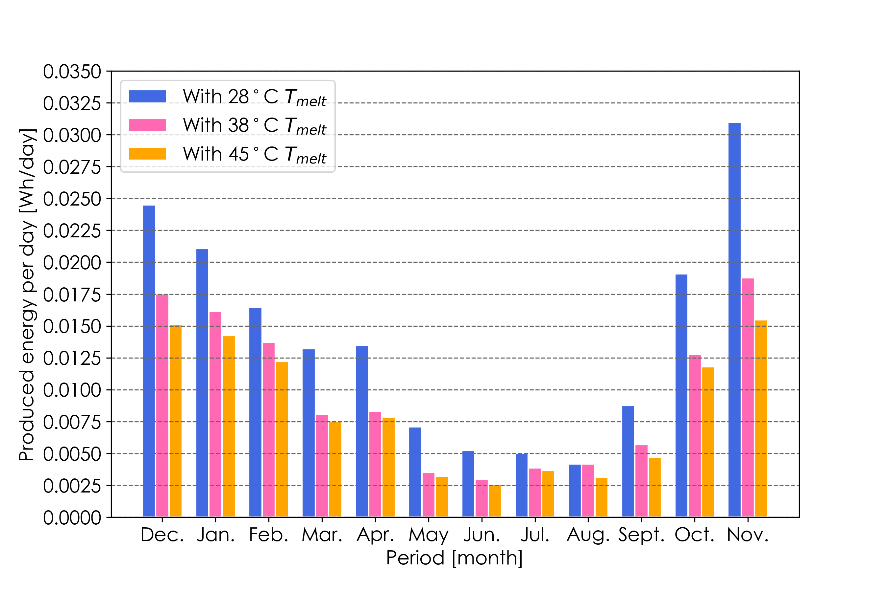

Hi, there!

Recently, I finished my 12 experimental sets to evaluate the generation performance of thermoelectric generator-assisted energy harvesting blocks. It took almost 2 months, and each case roughly required 3-4 days to derive generation profiles. 

From now on, I am writing an additional paper which might be my last paper in BMES laboratory at Hanyang University. Thanks for all helps from my collegues. :smiley:

